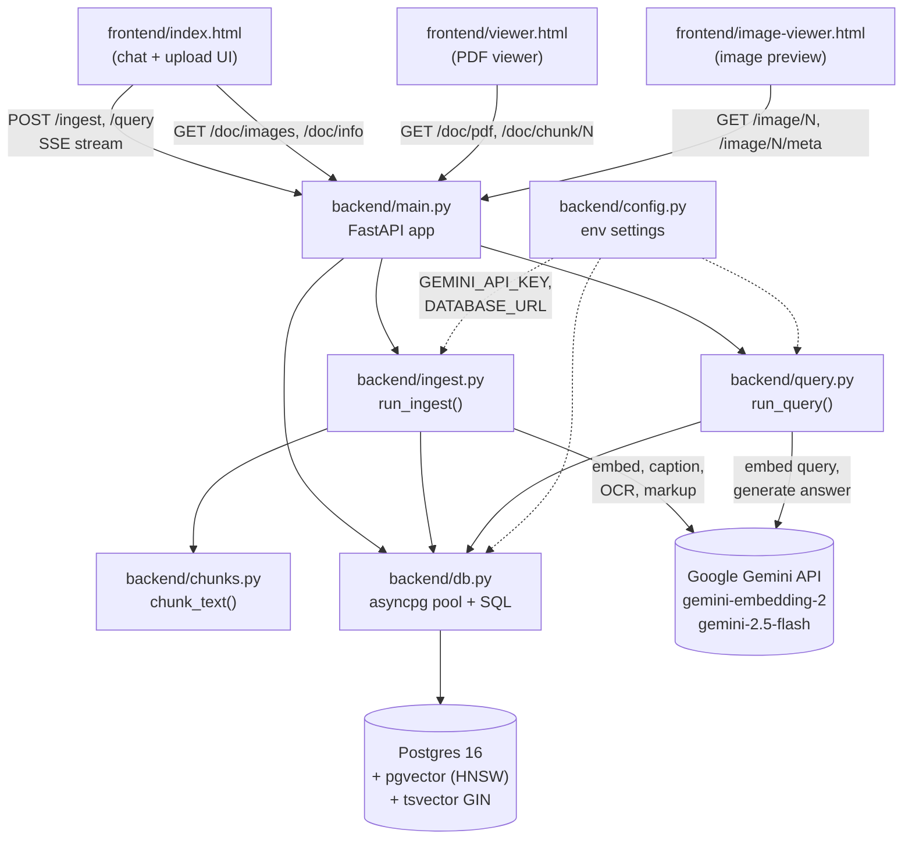

<!-- generated-by: gsd-doc-writer -->
# Architecture

## System overview

DocRAG is a single-document Retrieval-Augmented Generation system. A user uploads
one PDF; the backend extracts text, optionally OCRs scanned pages, optionally
detects hand-drawn markup, optionally extracts and captions embedded figures,
chunks the text, embeds every chunk (text and image-caption alike) with
`gemini-embedding-2` (768-dim), and stores everything in a single Postgres 16
table backed by pgvector (HNSW) + a generated `tsvector` column for full-text
search. Queries embed the question, run a hybrid search (dense pgvector +
sparse BM25, fused via Reciprocal Rank Fusion in a single SQL statement) and
stream a Gemini 2.5 Flash multimodal answer over Server-Sent Events. The
architecture is a layered request-handler-pipeline style: FastAPI handlers in
`backend/main.py` delegate to two pure async generators (`ingest.run_ingest`
and `query.run_query`) that emit progress / token events for the frontend.

The entire system is single-document: the `/ingest` endpoint truncates the
`chunks` table on every successful upload (`db.clear_all_chunks` is called
mid-ingest in `backend/ingest.py:825`). At any time exactly one document is
indexed; `_state` in `main.py:35` holds its `doc_id`, `chunk_count`, and
adaptive top-`k` value in process memory and is restored from `doc_meta` on
startup via the FastAPI `lifespan` hook (`main.py:38-55`).

## Component diagram



The codebase has six top-level Python modules under `backend/` and three
HTML files under `frontend/`. There is no client-side bundle step — each HTML
file is self-contained and served directly by FastAPI via `FileResponse`
(`main.py:69-92, 116-122`).

## Data flow

### Ingest pipeline

The ingest pipeline is an async generator (`backend/ingest.py:746`) that
yields a status event at every stage so the frontend can show progress.
Each `yield` corresponds to one `data: {...}` SSE frame written by
`main.py:193-212`.

```
Browser POST /ingest (multipart: file, process_images, ocr_scanned,
                                 detect_markup, markup_pages)
   │
   ▼
main.py:ingest_pdf()
   │  validates .pdf extension and 500 MB size cap (main.py:173, 184-191)
   ▼
ingest.run_ingest(pdf_bytes, ...)
   │
   ├─ doc_id = sha256(pdf_bytes)[:16]                       (ingest.py:157)
   │  if db.doc_exists(doc_id): yield {"status": "done", "cached": True}
   │
   ├─ yield {"status": "extracting"}
   │  _extract_text(pdf_bytes)  via PyMuPDF (fitz)          (ingest.py:217)
   │     – returns (full_text, per_page_texts)
   │     – appends "[Annotations on this page: ...]" summary built from
   │       PDF Highlight/Underline/StrikeOut/FreeText/Text annots
   │
   ├─ if ocr_scanned and any page is empty/sparse:
   │      yield {"status": "ocr"}
   │      _ocr_empty_pages → Gemini Vision OCR per page
   │      (concurrency = _GEMINI_CONCURRENCY = 8)            (ingest.py:677)
   │
   ├─ if detect_markup:
   │      yield {"status": "markup"}
   │      _collect_visual_markup → Vision call per text page
   │      (concurrency = _MARKUP_CONCURRENCY = 32)           (ingest.py:643)
   │      Returns {page → [{type, color, text}, ...]} which is appended
   │      as "[Visual markup on this page: ...]" so it flows into chunks.
   │
   ├─ yield {"status": "chunking"}
   │  total_tokens = tiktoken.encode(text)
   │  chunk_size, k = compute_params(total_tokens)           (ingest.py:161)
   │     <10k tok → (256, 5);  10–50k → (384, 8);
   │     50–200k → (512, 12);  200–500k → (768, 15);
   │     ≥500k   → (1024, 20)
   │  chunk_text(text, chunk_size)  sentence-boundary +      (chunks.py:7)
   │     newline split, 64-token overlap
   │
   ├─ yield {"status": "clearing"}                           (single-doc system)
   │  db.clear_all_chunks → TRUNCATE TABLE chunks RESTART IDENTITY
   │
   ├─ yield {"status": "embedding", "progress": 0}
   │  asyncio.gather (bounded sem=8) of _embed_one(chunk):
   │     gemini-embedding-2, output_dimensionality=768,
   │     task_type="RETRIEVAL_DOCUMENT"                       (ingest.py:271)
   │  parents[i] = chunks[i-1] + chunks[i] + chunks[i+1]      (ingest.py:720)
   │  page_nums[i] via _find_chunk_page anchor matching       (ingest.py:245)
   │  db.insert_chunks → INSERT into chunks (chunk_type='text')
   │
   ├─ if process_images:
   │      yield {"status": "extracting_images"}
   │      _extract_images two-stage:                          (ingest.py:303)
   │         Stage 1 — embedded images via PyMuPDF
   │             page.get_images(full=True) + extract_image(xref)
   │             filter: ≥200 px, ≥5000 bytes, mime ∈
   │                {png, jpeg, webp, gif}
   │         Stage 2 — full-page render at 150 DPI on pages with
   │             no embedded image AND text length ≤ 200
   │
   │      yield {"status": "captioning"}
   │      _caption_image (Gemini Vision, 1024-px max, JPEG q=85)
   │      Drop captions matching _is_blank_caption()          (ingest.py:87)
   │
   │      yield {"status": "embedding_images"}
   │      _embed_one(caption) for each kept image
   │      db.insert_image_chunks                              (db.py:111)
   │         INSERT chunk_type='image', image_data BYTEA,
   │         image_mime, parent_text = adjacent ±1 page text
   │
   └─ db.upsert_doc_meta(doc_id, total, k)                   (db.py:249)
      yield {"status": "done", "doc_id", "chunk_count",
             "image_count", "k"}
   ▼
main.py captures "done" event → updates _state, writes
        pdf_bytes to /tmp/docrag_current.pdf                 (main.py:202-206)
```

### Query pipeline

The query pipeline (`backend/query.py:155`) runs a single hybrid SQL search
and streams the answer. It does **not** include a re-ranking step — the
hybrid RRF score from Postgres is used directly.

```
Browser POST /query  body: { question, history[] }
   │
   ▼
main.py:query_doc()  → 400 if no doc loaded                   (main.py:231-236)
   │
   ▼
query.run_query(question, doc_id, k, history)
   │
   ├─ if history and pronoun in question:
   │      yield {"type": "status", "text": "Rewriting query…"}
   │      _rewrite_query → gemini-2.5-flash resolves pronouns (query.py:79)
   │
   ├─ yield {"type": "status", "text": "Embedding query…"}
   │  _embed_query(question)
   │     gemini-embedding-2, 768-dim, task_type="RETRIEVAL_QUERY"
   │
   ├─ yield {"type": "status", "text": "Searching database…"}
   │  db.search_chunks(pool, doc_id, query_emb, question, k)  (db.py:177)
   │     runs _HYBRID_SQL — see "Hybrid search design" below
   │
   ├─ if not raw_chunks:
   │      yield {"type": "token", "text": "I don't know."}
   │      yield {"type": "done"}; return
   │
   ├─ yield {"type": "sources", "chunks": [...]}   (frontend renders citations)
   │
   ├─ for c in raw_chunks where chunk_type == 'image':
   │      images[c.chunk_index] = db.get_chunk_image(...)     (db.py:217)
   │
   ├─ contents = _build_multimodal_contents(...)              (query.py:125)
   │     interleaves text parts and types.Part.from_bytes(image)
   │     so Gemini sees each retrieved image inline after its
   │     [Chunk N] caption
   │
   └─ async for chunk in client.aio.models.generate_content_stream(
            model="gemini-2.5-flash", contents=contents):
          yield {"type": "token", "text": chunk.text}
      yield {"type": "done"}
   ▼
main.py wraps every event as `data: {...}\n\n` SSE frame      (main.py:243)
```

Note that `run_query` never invokes a separate re-ranker model. The order
returned by `_HYBRID_SQL` (RRF score descending) is the final order passed
to the generator.

## Key abstractions

| Symbol | File | Purpose |
|---|---|---|
| `app: FastAPI` | `backend/main.py:58` | Application instance with `lifespan` that restores `_state` from `doc_meta` on startup. |
| `ingest.run_ingest()` | `backend/ingest.py:746` | Async generator; full ingest pipeline, yields status events. |
| `query.run_query()` | `backend/query.py:155` | Async generator; embed → hybrid search → multimodal stream. |
| `chunks.chunk_text()` | `backend/chunks.py:7` | Sentence-boundary chunker with token-budget overlap (default `max_tokens=512`, `overlap=64`); splits on `[.!?]\s+` *or* newlines so unpunctuated OCR/handwritten text still chunks. |
| `db.get_pool()` | `backend/db.py:74` | Lazy asyncpg pool factory; runs `SCHEMA` + `MIGRATION` DDL on first acquire. |
| `db.search_chunks()` | `backend/db.py:177` | Dispatches to `_HYBRID_SQL` (when a `question` is supplied) or `_DENSE_SQL` (vector-only fallback). |
| `db.SCHEMA` / `db.MIGRATION` | `backend/db.py:7, 36` | DDL constants applied idempotently per pool init. |
| `db.insert_chunks()` / `db.insert_image_chunks()` | `backend/db.py:95, 111` | Two writers that share the `chunks` table — text rows have `chunk_type='text'`, image rows carry `image_data BYTEA` + `image_mime`. |
| `ingest.compute_params()` | `backend/ingest.py:161` | Pure function mapping document token count to `(chunk_size, k)`. |
| `ingest._gather_bounded()` | `backend/ingest.py:734` | Semaphore-bounded `asyncio.gather`; used for embed/caption/OCR/markup fan-out. |
| `query._build_multimodal_contents()` | `backend/query.py:125` | Builds the Gemini `contents` list, inserting `Part.from_bytes(image)` immediately after each image chunk's caption line. |
| `_state` | `backend/main.py:35` | Process-wide dict `{doc_id, chunk_count, k}` — holds the current loaded document. |

## Data model

All persistent state lives in two Postgres tables defined in
`backend/db.py:7`. There is no separate object store; image bytes are stored
inline in the `chunks` table as `BYTEA`.

### `chunks` table

```sql
CREATE TABLE chunks (
    id          SERIAL PRIMARY KEY,
    doc_id      TEXT NOT NULL,
    chunk_index INTEGER NOT NULL,
    text        TEXT NOT NULL,           -- chunk body (or image caption)
    parent_text TEXT,                    -- prev+self+next chunk window,
                                         -- or adjacent ±1 page text for images
    page_number INTEGER,                 -- 1-indexed PDF page
    chunk_type  TEXT NOT NULL DEFAULT 'text',  -- 'text' | 'image'
    image_data  BYTEA,                   -- raw image bytes (image rows only)
    image_mime  TEXT,                    -- e.g. 'image/png', 'image/jpeg'
    embedding   vector(768) NOT NULL,    -- pgvector column
    tsv         tsvector GENERATED ALWAYS AS
                  (to_tsvector('english', coalesce(text, ''))) STORED,
    created_at  TIMESTAMPTZ DEFAULT now()
);

CREATE INDEX chunks_embedding_idx ON chunks USING hnsw (embedding vector_cosine_ops);
CREATE INDEX chunks_tsv_idx       ON chunks USING gin(tsv);
```

Notes:

- `text` and `embedding` carry double duty across chunk types. For an image row,
  `text` is the Gemini Vision caption, and `embedding` is the embedding of that
  caption (not of the image pixels). The system rejected multimodal embedding
  in favor of caption-then-embed because the caption is needed anyway for the
  prompt label and BM25 (`README.md` records this design decision).
- `tsv` is a generated column over `text` only — `parent_text` is intentionally
  excluded so BM25 ranks by the chunk's own content.
- The HNSW index uses cosine distance (`vector_cosine_ops`); the SQL converts
  it to a similarity score with `1 - (embedding <=> $1::vector)`.
- The `MIGRATION` block in `db.py:36-71` adds `parent_text`, `tsv`,
  `page_number`, `chunk_type`, `image_data`, and `image_mime` to existing
  installations and drops a now-unused `ocr_lines` table from earlier versions.

### `doc_meta` table

```sql
CREATE TABLE doc_meta (
    doc_id      TEXT PRIMARY KEY,
    chunk_count INTEGER NOT NULL,
    k           INTEGER NOT NULL,        -- adaptive top-k chosen at ingest
    created_at  TIMESTAMPTZ DEFAULT now()
);
```

`get_latest_doc()` reads the most recent row and is what `lifespan` uses to
restore `_state` after a server restart (`main.py:42-46`).

## Hybrid search design

The retrieval step is a single SQL statement — `_HYBRID_SQL` in
`backend/db.py:129-166` — that fuses dense vector search and sparse BM25 via
Reciprocal Rank Fusion (RRF) inside Postgres. There is no Python-side
re-ranking pass.

```sql
WITH
dense AS (
    SELECT chunk_index, ..., 1 - (embedding <=> $1::vector) AS similarity,
           ROW_NUMBER() OVER (ORDER BY embedding <=> $1::vector) AS rank
    FROM chunks WHERE doc_id = $2
    ORDER BY embedding <=> $1::vector LIMIT $3 * 2          -- top 2k
),
sparse AS (
    SELECT chunk_index, ...,
           ROW_NUMBER() OVER (
               ORDER BY ts_rank_cd(tsv, plainto_tsquery('english', $4)) DESC
           ) AS rank
    FROM chunks
    WHERE doc_id = $2
      AND tsv @@ plainto_tsquery('english', $4)
    ORDER BY ts_rank_cd(tsv, plainto_tsquery('english', $4)) DESC
    LIMIT $3 * 2                                            -- top 2k
),
fused AS (
    SELECT
        COALESCE(d.chunk_index, s.chunk_index) AS chunk_index,
        ...
        COALESCE(d.similarity, 0.0) AS similarity,
        COALESCE(1.0 / (60.0 + d.rank), 0.0)
      + COALESCE(1.0 / (60.0 + s.rank), 0.0) AS rrf_score
    FROM dense d
    FULL OUTER JOIN sparse s ON d.chunk_index = s.chunk_index
)
SELECT ..., similarity, rrf_score
FROM fused
ORDER BY rrf_score DESC
LIMIT $3;
```

Design points:

- **Two CTEs, one query** — both sides share the same row in the `chunks` table
  (and therefore the same `embedding` and `tsv` columns), so the dense and
  sparse passes are independent index lookups in a single round trip.
- **HNSW for dense** — `chunks_embedding_idx` uses `vector_cosine_ops`.
- **`tsvector`/GIN for sparse** — the generated `tsv` column is indexed by
  `chunks_tsv_idx` (GIN). The sparse CTE is filtered by `tsv @@ plainto_tsquery`,
  so it only contributes rows the BM25 query actually matches.
- **RRF with k=60** — the constant `60.0` in `1.0 / (60.0 + rank)` is the
  standard RRF damping value. Each chunk's contribution from each side is
  `1/(60+rank_in_that_side)`, summed via `FULL OUTER JOIN`. A chunk found by
  only one side still scores; a chunk in both sides scores higher.
- **Over-fetch then trim** — both CTEs pull `LIMIT $3 * 2` (`2k`) candidates
  before the fusion `LIMIT $3`. This keeps mid-ranked items from one side
  available for fusion with the other side.
- **Vector-only fallback** — `db.search_chunks` falls back to `_DENSE_SQL`
  (`db.py:168-174`) when the question is empty/whitespace, e.g. a structured
  retrieval triggered without a textual query.
- **No re-ranker** — `query.run_query` consumes the fused list as-is. The
  README records that an LLM re-rank step was removed because the hybrid RRF
  output was already strong enough that the extra latency was not justified.

The returned rows carry both `similarity` (cosine, for the UI/logs) and
`rrf_score` (the actual ranking key); `query.py:190-204` exposes both to the
frontend in the `sources` SSE event.

## Directory structure rationale

```
nymbl-demo-RAG-system/
├── backend/                # All server code (FastAPI app + pipelines)
│   ├── main.py             # HTTP routes, SSE streaming, app lifespan / state
│   ├── ingest.py           # PDF → text/images → embed → store pipeline
│   ├── query.py            # Embed query → hybrid search → multimodal answer
│   ├── chunks.py           # Pure tiktoken-aware sentence chunker
│   ├── db.py               # asyncpg pool, SQL constants, schema/migration
│   └── config.py           # Env-var loader (GEMINI_API_KEY, DATABASE_URL)
├── frontend/               # Three self-contained HTML/CSS/JS files
│   ├── index.html          # Chat + upload UI; main entry point
│   ├── viewer.html         # PDF viewer with chunk highlighting
│   └── image-viewer.html   # Standalone image preview window
├── docker-compose.yml      # pgvector/pgvector:pg16 service definition
├── Makefile                # `make db | setup | dev | test | logs | reset`
├── pytest.ini              # Test runner config
├── requirements.txt        # Python dependencies
├── tests/                  # Pytest suite (chunker, ingest, query, db)
├── docs/                   # Generated and authored documentation
└── logs/                   # Rotating app log (5 MB × 3 backups)
```

Why this shape:

- **Flat `backend/` package** — only six modules and they correspond directly
  to architectural concerns (HTTP, ingest, query, chunking, persistence,
  config). A subpackage layout would add ceremony without splitting any module
  worth splitting.
- **Two pipelines, one DB module** — `ingest.py` and `query.py` never import
  each other. Their only shared dependency is `db.py` (pool + SQL) and
  `config.py` (env). This is what lets the SSE handlers in `main.py` stay
  thin: each just wraps an async generator from one of the two pipelines.
- **`frontend/` as static assets** — no build step, no `node_modules`. The
  three HTML files are served directly via `FileResponse` from `main.py`
  (`/`, `/viewer`, `/image-viewer`). Cache-Control headers disable caching
  on the viewer pages so a re-ingest is reflected immediately.
- **Single-document by design** — `db.clear_all_chunks` (TRUNCATE) is called
  during ingest. There is no `documents` table, no foreign keys; the system
  trades multi-doc support for a smaller schema and a simpler frontend.
- **Image bytes in `BYTEA`** — keeps deployment to a single Postgres container.
  An object store would be the next step if multi-doc support were added.
